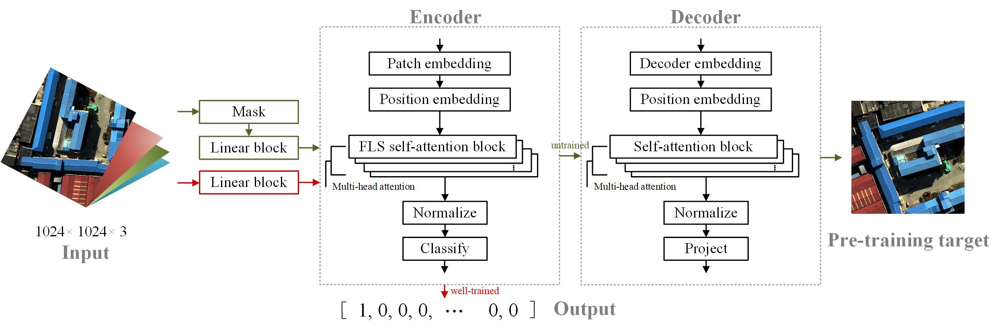

# FLS-ViR
[[paper]](https://ieeexplore.ieee.org/abstract/document/10479472)[[code]](https://github.com/LinHe1995/FLS-ViR)[[dataset]](https://pan.baidu.com/s/1Tlinp4EPy8RGLSCFeL562Q)

## Abstract
In the past decade, deep neural networks have been widely introduced into remote sensing image interpretation tasks. Exploring how to improve the model at some critical points, such as making it more suitable for remote sensing data, is still lacking, which makes more sense than developing stacked and transformed network structures, as is the expertise of scholars in the field of deep learning. To tackle this issue, this article proposes a fixed-length sequence-vision reformer (FLS-ViR) model. Relying on an advanced attention encoder with a reversible residual network structure, the presented model drastically decreases the spatial complexity. In contrast to most models that take input image sizes with 200+ pixels as edges, it will help us allow the input of large-size images under limited equipment conditions, thereby making fuller use of high spatial resolution data information. The introduction of a self-supervised method further improves the detection accuracy. Meanwhile, we built a high spatial resolution aerial image dataset for scene classification, which is superior in terms of high interclass similarity and diversity of image variations. To validate and evaluate the method and dataset, we performed a comparison of accuracy and memory consumption on a similar aerial dataset and attention-base models. The effectiveness of our model and its fitness on remote sensing datasets with a limited sample size is proved. Meanwhile, the investigation of the heat map demonstrates that increasing the size of the input image has a positive effect on optimizing the features captured by the model for remote sensing image scenes.

## Approach

